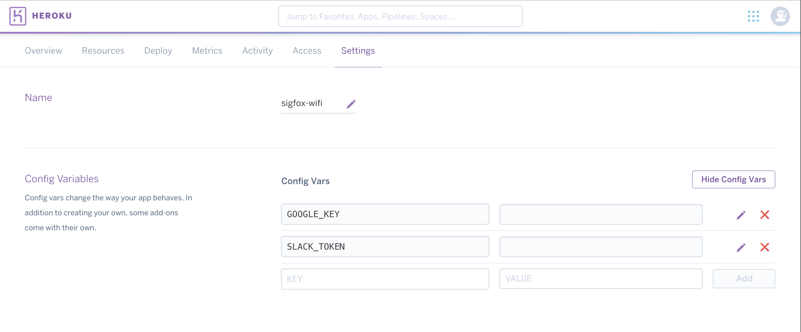

# Wifi+Sigfox based geolocation démo

## Purpose

* Gather the MAC address of the two "strongest" wifi networks
* Send them over the Sigfox network
* Use Google Geolocation API to get an approximate location
* Publish to Slack a Google Maps snapshot of the computed location

This a *demo* and not intended to be used in production.  
This does not tackle

* Battery optimisation
* Code robustness
* Data compression
* ...

## Hardware

* Using a [SiPy](https://www.pycom.io/product/sipy/) from Pycom, which combines Sigfox & Wifi connectivities.
The SiPy is programmed in micropython, find the sample code in the [sipy](./sipy) folder
* [Arduino MKR1000](https://store.arduino.cc/product/GBX00011) + [SNOC Breakout Board - Sigfox BRKWS01](https://yadom.fr/carte-breakout-sfm10r1.html). It works with the Arduino IDE, find the samples code in the [mkr1000-snoc](./mkr1000-snoc) folder.

## Cloud application

### Local Setup

Make sure you have nodeJS properly installed on your system

Then run `$ npm install` to install the dependencies

`$ npm run`will start the server.

Make sure you properly set the following environnement variables :
* `GOOGLE_KEY` your key to use [Google's apis](https://developers.google.com/maps/documentation/geolocation/get-api-key)
* `SLACK_TOKEN` the private part of your [Slack Webhook](https://api.slack.com/incoming-webhooks) URL

### Deploy online
You can easily deploy on Heroku, using the following commands under your root directory:
* `$ heroku apps:create your-app-name`
* `$ heroku config:set --app your-app-name  GOOGLE_KEY=xxxxxx SLACK_TOKEN=yyyyy/zzzz`
* `$ git push heroku master`

or  and don't forget to add your envrionment variables: 

### Sigfox setup

Once you're application is deployed online (Heroku or else where, doesn't matter), add a callback on the [Sigfox backend](http://backend.sigfox.com) with the following settings :

* Channel : `URL`
* Type : `DATA/UPLINK `
* URL : `http://example.com/locations`
* Method : `POST`
* Content-Type : `application/json`
* Request body : `{"device":"{device}", "time":"{time}", "data":"{data}"}`

## Slack notification

Here is the kind of notification that you will receive :

